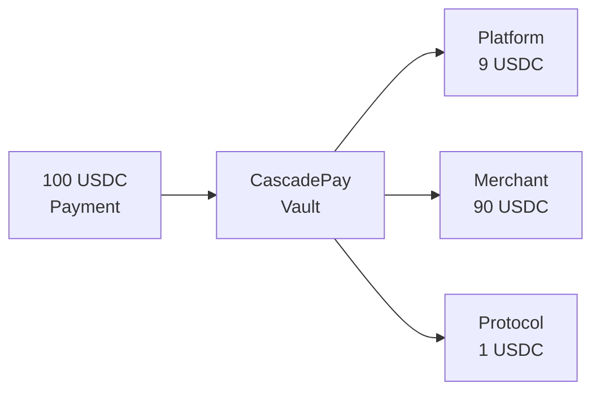

# cascadepay

**One payment in. Multiple recipients out. Automatically.**

A non-custodial payment splitter for Solana that distributes incoming payments to multiple recipients based on pre-configured percentages.



---

## 🚀 Live on Devnet

**Program ID:** [`Bi1y2G3hteJwbeQk7QAW9Uk7Qq2h9bPbDYhPCKSuE2W2`](https://solscan.io/account/Bi1y2G3hteJwbeQk7QAW9Uk7Qq2h9bPbDYhPCKSuE2W2?cluster=devnet)

**Protocol Fee Wallet:** [`2zMEvEkyQKTRjiGkwYPXjPsJUp8eR1rVjoYQ7PzVVZnP`](https://solscan.io/account/2zMEvEkyQKTRjiGkwYPXjPsJUp8eR1rVjoYQ7PzVVZnP)

**Network:** Solana Devnet
**Framework:** Anchor 0.32.1
**Status:** ✅ Deployed & Tested

---

## Why cascadepay?

### Without cascadepay:
1. Customer pays merchant
2. Merchant manually calculates platform fee
3. Merchant sends separate payment to platform
4. Time-consuming, error-prone, trust-required

### With cascadepay:
1. Customer pays once
2. **Automatic split to all parties**
3. Done. ✨

---

## Core Value

**For Marketplaces & Platforms:**
- Instant revenue collection (no waiting for merchant payments)
- No trust required (enforced by smart contract)
- Zero manual reconciliation

**For Merchants:**
- Single payment address for customers
- Automatic partner payouts
- Transparent fee structure

**For Users:**
- Pay once, done
- Same UX as regular payments
- Works with existing wallets

---

## Features

- ✅ **Non-custodial** - Funds controlled by program, not individuals
- ✅ **2-20 recipients** - Split between multiple parties
- ✅ **Atomic execution** - Payment + split in single transaction (via x402)
- ✅ **Token-2022 ready** - Supports all SPL tokens and extensions
- ✅ **Graceful failures** - If recipient ATA missing, funds held for claiming
- ✅ **Permissionless** - Anyone can trigger distribution
- ✅ **1% protocol fee** - Sustainable, fair pricing

---

## Quick Start

### Installation

```bash
npm install @cascadepay/sdk @coral-xyz/anchor
# or
pnpm add @cascadepay/sdk @coral-xyz/anchor
```

### Usage

```typescript
import { createCascadepayClient } from "@cascadepay/sdk";
import * as anchor from "@coral-xyz/anchor";

// Initialize SDK
const connection = new anchor.web3.Connection("https://api.devnet.solana.com");
const wallet = new anchor.Wallet(yourKeypair);
const idl = require("./cascadepay.json"); // Download from deployment

const sdk = await createCascadepayClient(connection, wallet, idl);

// Create split config (99% total for recipients)
const recipients = [
  { address: platformWallet, percentageBps: 900 },   // 9%
  { address: merchantWallet, percentageBps: 9000 },  // 90%
];

const configPDA = await sdk.createSplitConfig({
  mint: USDC_MINT,
  recipients,
});

// Get vault address to share with customers
const config = await sdk.getSplitConfig(configPDA);
console.log("Payment vault:", config.vault.toString());

// Execute split (permissionless - anyone can call)
const tx = await sdk.executeSplit(configPDA);
```

**Result:**
```
$100 payment → $9 platform + $90 merchant + $1 protocol
```

---

## For x402 Facilitators (PayAI, Coinbase CDP)

### Auto-detect and bundle atomically

```typescript
import { detectSplitVault } from "@cascadepay/sdk";
import * as anchor from "@coral-xyz/anchor";

// Detect if payment destination is a CascadePay vault
const result = await detectSplitVault(
  paymentDestination,
  connection,
  new anchor.web3.PublicKey("Bi1y2G3hteJwbeQk7QAW9Uk7Qq2h9bPbDYhPCKSuE2W2")
);

if (result.isSplitVault) {
  // Build atomic transaction: transfer + execute_split
  const transferIx = createTransferInstruction(
    userTokenAccount,
    result.splitConfig.vault,  // CascadePay vault
    user.publicKey,
    amount
  );

  const splitIx = await sdk.buildExecuteSplitInstruction(result.splitConfig);

  const tx = new anchor.web3.Transaction()
    .add(transferIx)   // User payment
    .add(splitIx);     // Instant distribution

  // User signs once → both execute atomically
  await sendAndConfirm(tx);
}
```

**Result:** Seamless UX - user pays once, funds split instantly.

---

## Use Cases

### 🛒 Marketplaces
Split customer payments between platform and merchants instantly.

### 💼 Revenue Sharing
Distribute income to founders, investors, and advisors automatically.

### 🎫 Event Ticketing
Split ticket sales between venue, organizer, and platform.

### 💳 Subscription Services
Automatic affiliate and platform fee distribution.

### 🎮 Gaming Platforms
Split in-game purchases between developers, publishers, and platform.

---

## How It Works

1. **Setup** - Create split config with recipients and percentages (must total 99%)
2. **Payment** - Customers send funds to vault address
3. **Execute** - Anyone calls `execute_split()` to distribute funds
4. **Done** - Recipients receive shares, protocol gets 1%

**With x402 Integration (PayAI, Coinbase CDP):**
Payment + split bundled atomically → instant distribution, seamless UX.

---

## Architecture

### Program Instructions

| Instruction | Description | Authority Required |
|------------|-------------|-------------------|
| `create_split_config` | Initialize vault and split config | Yes (creator) |
| `execute_split` | Drain vault and distribute funds | No (permissionless) |
| `update_split_config` | Update recipients (vault must be empty) | Yes (creator) |
| `close_split_config` | Close config and reclaim rent | Yes (creator) |
| `claim_unclaimed` | Recipients claim failed distributions | Yes (recipient) |

### Account Structure

**SplitConfig PDA:**
- Seeds: `["split_config", authority, mint]`
- Contains: Recipients, percentages, vault address, unclaimed amounts
- Space: ~1KB (dynamic based on recipient count)

**Vault:**
- Associated Token Account (ATA) owned by SplitConfig PDA
- Holds incoming payments until executed
- Drained to zero on each `execute_split()`

---

## Development

### Prerequisites

```bash
# Install Rust
curl --proto '=https' --tlsv1.2 -sSf https://sh.rustup.rs | sh

# Install Solana CLI
sh -c "$(curl -sSfL https://release.solana.com/stable/install)"

# Install Anchor CLI
cargo install --git https://github.com/coral-xyz/anchor avm --locked --force
avm install 0.32.1
avm use 0.32.1
```

### Build & Test

```bash
# Clone repository
git clone https://github.com/tenequm/cascadepay
cd cascadepay

# Install dependencies
pnpm install

# Build program
anchor build

# Run tests on devnet
anchor test

# Or skip build/deploy if already deployed
anchor test --skip-build --skip-deploy
```

### Deploy

```bash
# Deploy to devnet
anchor deploy --provider.cluster devnet

# Upload IDL
anchor idl init --filepath target/idl/cascadepay.json <PROGRAM_ID>
```

---

## SDK Reference

See [**SDK Documentation**](sdk/README.md) for comprehensive API reference.

### Key Methods

- `createSplitConfig(params)` - Create new split configuration
- `executeSplit(splitConfigPDA)` - Execute payment distribution
- `buildExecuteSplitInstruction(splitConfigPDA)` - Build execute instruction for atomic bundling
- `getSplitConfig(splitConfigPDA)` - Fetch configuration
- `claimUnclaimed(splitConfigPDA, recipient)` - Claim failed payments
- `updateSplitConfig(splitConfigPDA, newRecipients)` - Update recipients
- `closeSplitConfig(splitConfigPDA)` - Close and reclaim rent
- `detectSplitVault(destination, connection, programId)` - Detect if address is a split vault

---

## Resources

- 📖 **[Full Specification](docs/specification.md)** - Protocol details
- 📦 **[SDK README](sdk/README.md)** - TypeScript SDK documentation
- 📦 **[NPM Package](https://www.npmjs.com/package/@cascadepay/sdk)** - Install SDK
- 🔗 **[Solscan (Devnet)](https://solscan.io/account/Bi1y2G3hteJwbeQk7QAW9Uk7Qq2h9bPbDYhPCKSuE2W2?cluster=devnet)** - View on-chain program
- 🌐 **Website:** [cascadepay.io](https://cascadepay.io)
- 🐦 **Twitter:** [@cascadepay](https://x.com/cascadepay)
- 📧 **Contact:** hello@cascadepay.io

---

## Project Status

✅ **Phase 1: Complete** - Core protocol implementation
- [x] Program design & specification
- [x] Rust program implementation (5 instructions)
- [x] Devnet deployment
- [x] E2E tests passing on devnet

✅ **Phase 2: Complete** - TypeScript SDK
- [x] SDK implementation with @solana/kit
- [x] Comprehensive documentation
- [x] Example code
- [x] Split vault detection for x402

🚧 **Phase 3: In Progress** - Integration & Launch
- [ ] Security audit
- [ ] Mainnet deployment
- [x] x402 facilitator integrations (PayAI, Coinbase CDP)
- [ ] Production monitoring

---

## Tech Stack

- **Anchor Framework** 0.32.1 - Solana program development
- **@solana/kit** v5 - Modern Solana client library
- **SPL Token / Token-2022** - Full token standard support
- **TypeScript SDK** - Easy integration for developers

---

## Security

⚠️ **This program is unaudited and deployed on devnet only.** Do not use in production without a professional security audit.

**Security features:**
- Non-custodial design (no admin controls after creation)
- Immutable protocol fee (hardcoded 1%)
- Account validation via Anchor constraints
- Graceful degradation (failed distributions → unclaimed queue)

---

## License

MIT

---

## Built For

This project is built for the [x402 Solana Hackathon](https://solana.com/x402/hackathon) and integrates with the x402 payment infrastructure.

**Target integrations:** PayAI, Coinbase CDP, x402 facilitators

---

**cascadepay** - Payment splitting, simplified.
