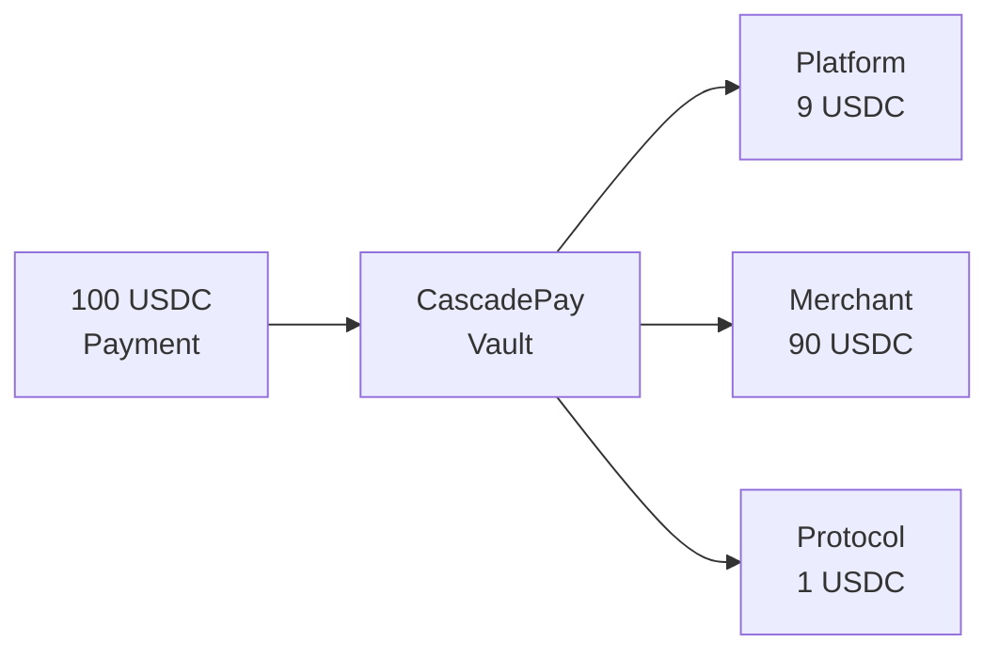

# cascadepay

**One payment in. Multiple recipients out. Automatically.**

A non-custodial payment splitter for Solana that distributes incoming payments to multiple recipients based on pre-configured percentages.



---

## 🚀 Live on Mainnet

**Program ID:** [`Bi1y2G3hteJwbeQk7QAW9Uk7Qq2h9bPbDYhPCKSuE2W2`](https://solscan.io/account/Bi1y2G3hteJwbeQk7QAW9Uk7Qq2h9bPbDYhPCKSuE2W2)

**Protocol Fee Wallet:** `2zMEvEkyQKTRjiGkwYPXjPsJUp8eR1rVjoYQ7PzVVZnP`

**Network:** Solana Mainnet-Beta
**Framework:** Anchor 0.32.1

---

## Features

- **Non-custodial** - Funds controlled by program, not individuals
- **2-20 recipients** - Split payments between multiple parties
- **Token-2022 ready** - Supports all SPL tokens and extensions
- **Permissionless execution** - Anyone can trigger distribution
- **Graceful failures** - Funds held for claiming if recipient ATA missing
- **1% protocol fee** - Sustainable, transparent pricing

---

## Quick Start

### Installation

```bash
npm install @cascadepay/sdk @coral-xyz/anchor
```

### Basic Usage

```typescript
import { createCascadepayClient } from "@cascadepay/sdk";
import * as anchor from "@coral-xyz/anchor";

// Initialize client
const connection = new anchor.web3.Connection("https://api.mainnet-beta.solana.com");
const wallet = new anchor.Wallet(yourKeypair);
const idl = require("@cascadepay/sdk/idl/cascadepay.json");

const sdk = await createCascadepayClient(connection, wallet, idl);

// Create split configuration (recipients must total 99%)
const recipients = [
  { address: platformWallet, percentageBps: 900 },   // 9%
  { address: merchantWallet, percentageBps: 9000 },  // 90%
];

const configPDA = await sdk.createSplitConfig({
  mint: USDC_MINT,
  recipients,
});

// Get vault address
const config = await sdk.getSplitConfig(configPDA);
console.log("Share this payment address:", config.vault.toString());

// Execute distribution (permissionless)
await sdk.executeSplit(configPDA);
```

---

## For x402 Facilitators

Atomic transaction bundling for seamless UX:

```typescript
import { detectSplitVault } from "@cascadepay/sdk";

// Detect if destination is a CascadePay vault
const result = await detectSplitVault(
  paymentDestination,
  connection,
  new anchor.web3.PublicKey("Bi1y2G3hteJwbeQk7QAW9Uk7Qq2h9bPbDYhPCKSuE2W2")
);

if (result.isSplitVault) {
  // Bundle payment + distribution atomically
  const transferIx = createTransferInstruction(
    userTokenAccount,
    result.splitConfig.vault,
    user.publicKey,
    amount
  );

  const splitIx = await sdk.buildExecuteSplitInstruction(result.splitConfig);

  const tx = new anchor.web3.Transaction()
    .add(transferIx)
    .add(splitIx);

  await sendAndConfirm(tx);
}
```

---

## Architecture

### Instructions

| Instruction | Description | Authority Required |
|------------|-------------|-------------------|
| `create_split_config` | Initialize vault and split configuration | Creator |
| `execute_split` | Distribute vault balance to recipients | None (permissionless) |
| `update_split_config` | Update recipients (requires empty vault) | Creator |
| `claim_unclaimed` | Claim held funds | Recipient |

### Account Structure

**SplitConfig PDA:**
- Seeds: `["split_config", authority, mint]`
- Contains: Recipients, percentages, vault address, unclaimed amounts

**Vault:**
- Associated Token Account owned by SplitConfig PDA
- Drained to zero on each `execute_split()`

---

## Development

### Prerequisites

```bash
# Install Rust & Solana
curl --proto '=https' --tlsv1.2 -sSf https://sh.rustup.rs | sh
sh -c "$(curl -sSfL https://release.solana.com/stable/install)"

# Install Anchor
cargo install --git https://github.com/coral-xyz/anchor avm --locked --force
avm install 0.32.1
avm use 0.32.1
```

### Build & Test

```bash
git clone https://github.com/tenequm/cascadepay
cd cascadepay
pnpm install
anchor build
anchor test
```

---

## Resources

- 📖 [Full Specification](docs/specification.md)
- 📦 [SDK Documentation](sdk/README.md)
- 📦 [NPM Package](https://www.npmjs.com/package/@cascadepay/sdk)
- 🔗 [Solscan](https://solscan.io/account/Bi1y2G3hteJwbeQk7QAW9Uk7Qq2h9bPbDYhPCKSuE2W2)
- 🌐 [cascadepay.io](https://cascadepay.io)
- 🐦 [@cascadepay](https://x.com/cascadepay)

---

## Security

⚠️ **This program is unaudited.** Use at your own risk.

**Security features:**
- Non-custodial design
- Immutable protocol fee (hardcoded 1%)
- Anchor constraint validation
- Graceful degradation for failures

---

## License

MIT

---

## Built For

[x402 Solana Hackathon](https://solana.com/x402/hackathon) - Payment infrastructure for the next generation of Solana applications.
