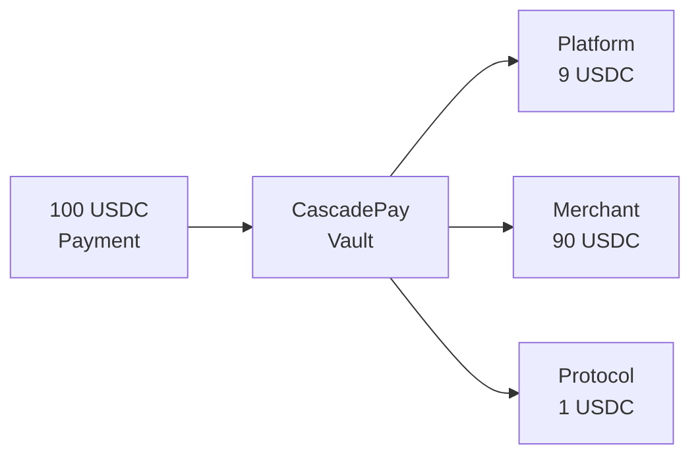

# cascadepay

**One payment in. Multiple recipients out. Automatically.**

A non-custodial payment splitter for Solana that distributes incoming payments to multiple recipients based on pre-configured percentages.



---

## Why cascadepay?

### Without cascadepay:
1. Customer pays merchant
2. Merchant manually calculates platform fee
3. Merchant sends separate payment to platform
4. Time-consuming, error-prone, trust-required

### With cascadepay:
1. Customer pays once
2. **Automatic split to all parties**
3. Done. ✨

---

## Core Value

**For Marketplaces & Platforms:**
- Instant revenue collection (no waiting for merchant payments)
- No trust required (enforced by smart contract)
- Zero manual reconciliation

**For Merchants:**
- Single payment address for customers
- Automatic partner payouts
- Transparent fee structure

**For Users:**
- Pay once, done
- Same UX as regular payments
- Works with existing wallets

---

## Features

- ✅ **Non-custodial** - Funds controlled by program, not individuals
- ✅ **2-20 recipients** - Split between multiple parties
- ✅ **Atomic execution** - Payment + split in single transaction (via x402)
- ✅ **Token-2022 ready** - Supports all SPL tokens and extensions
- ✅ **Graceful failures** - If recipient ATA missing, funds held for claiming
- ✅ **Permissionless** - Anyone can trigger distribution
- ✅ **1% protocol fee** - Sustainable, fair pricing

---

## Quick Example

```typescript
// Create split config
await createSplitConfig({
  authority: merchantKeypair,
  mint: USDC_MINT,
  recipients: [
    { address: platform, percentageBps: 900 },   // 9%
    { address: merchant, percentageBps: 9000 },  // 90%
  ],
});

// Share vault address with customers
// Payments automatically split on execution!
```

**Result:**
```
$100 payment → $9 platform + $90 merchant + $1 protocol
```

---

## Use Cases

### 🛒 Marketplaces
Split customer payments between platform and merchants instantly.

### 💼 Revenue Sharing
Distribute income to founders, investors, and advisors automatically.

### 🎫 Event Ticketing
Split ticket sales between venue, organizer, and platform.

### 💳 Subscription Services
Automatic affiliate and platform fee distribution.

### 🎮 Gaming Platforms
Split in-game purchases between developers, publishers, and platform.

---

## How It Works

1. **Setup** - Create split config with recipients and percentages (must total 99%)
2. **Payment** - Customers send funds to vault address
3. **Execute** - Anyone calls `execute_split()` to distribute funds
4. **Done** - Recipients receive shares, protocol gets 1%

**With x402 Integration (PayAI, Coinbase CDP):**
Payment + split bundled atomically → instant distribution, seamless UX.

---

## Tech Stack

- **Anchor Framework** 0.32.1
- **Solana** - High-speed, low-cost blockchain
- **SPL Token / Token-2022** - All token standards supported
- **TypeScript SDK** - Easy integration

---

## Getting Started

### Installation

```bash
# Clone repository
git clone https://github.com/tenequm/cascadepay
cd cascadepay

# Install dependencies
pnpm install

# Build program
anchor build

# Run tests
anchor test
```

### Documentation

- 📖 **[Full Specification](docs/specification.md)** - Protocol details
- 🌐 **Website:** [cascadepay.io](https://cascadepay.io)
- 📧 **Contact:** hello@cascadepay.io

---

## Status

🚧 **In Development** - Pre-launch testing phase

- [x] Core protocol design
- [x] Specification complete
- [ ] Program implementation
- [ ] TypeScript SDK
- [ ] Devnet deployment
- [ ] Security audit
- [ ] Mainnet launch

---

## License

ISC

---

## Built For

This project is built for the [Colosseum Cypherpunk Hackathon](https://colosseum.org) and integrates with the x402 payment infrastructure.

**Target integrations:** PayAI, Coinbase CDP, x402 facilitators

---

**cascadepay** - Payment splitting, simplified.
